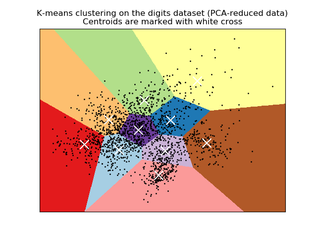

# digits数据集
为了方便可视化效果，对所有实验都先采用了PCA进行降维。
## K-means
示例中实验了三种初始化方式，并应用各种指标进行评价。从表格中可以看到PCA降维后能在保证结果质量的情况下大大提高计算速度，取得较好的结果。
```
n_digits: 10,    n_samples 1797,         n_features 64
__________________________________________________________________________________
init            time    inertia homo    compl   v-meas  ARI     AMI     silhouette
k-means++       0.28s   69432   0.602   0.650   0.625   0.465   0.621   0.146
random          0.19s   69694   0.669   0.710   0.689   0.553   0.686   0.147
PCA-based       0.03s   70804   0.671   0.698   0.684   0.561   0.681   0.118
__________________________________________________________________________________
```


## AffinityPropagation
比较难调，最后也没调好，不太适合数字分类任务

```
Estimated number of clusters: 42
Homogeneity: 0.547
Completeness: 0.350
V-measure: 0.427
Adjusted Rand Index: 0.154
Adjusted Mutual Information: 0.404
Silhouette Coefficient: 0.491
```


## MeanShift

`number of estimated clusters : 10`


## SpectralClustering
```
Estimated number of clusters: 10
Homogeneity: 0.159
Completeness: 0.541
V-measure: 0.245
Adjusted Rand Index: 0.039
Adjusted Mutual Information: 0.234
Silhouette Coefficient: 0.093
```


## AgglomerativeClustering
```
ward :  0.35s
average :       0.25s
complete :      0.24s
single :        0.12s
```
这个参数下就等同于ward hierarchical clustering方法

另外三种方法


## DBSCAN
```
Estimated number of clusters: 10
Estimated number of noise points: 537
Homogeneity: 0.249
Completeness: 0.415
V-measure: 0.312
Adjusted Rand Index: 0.129
Adjusted Mutual Information: 0.301
Silhouette Coefficient: -0.201
```

## GaussianMixture
```
Estimated number of clusters: 10
Estimated number of noise points: 0
Homogeneity: 0.462
Completeness: 0.475
V-measure: 0.468
Adjusted Rand Index: 0.328
Adjusted Mutual Information: 0.463
Silhouette Coefficient: 0.357
```


除了没调好的那几个外，不同方法得到的结果还是挺接近的，尤其是GaussianMixture和K-means，SpectralClustering和MeanShift
